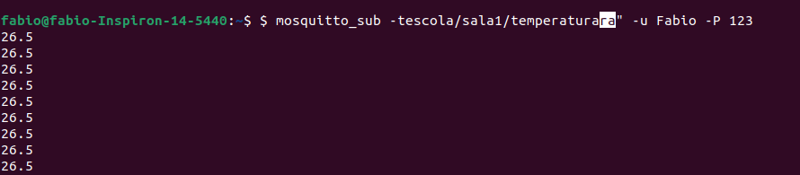

[](https://classroom.github.com/a/G8V_0Zaq)

# Tarefa: IoT Security Lab - EmbarcaTech 2025

Autores: **Fábio Gabriel da Silva barbosa**  e **Karen Beatrice Souza Gonçalves**

Curso: Residência Tecnológica em Sistemas Embarcados

Instituição: EmbarcaTech - HBr

Brasília-DF, Maio de 2025

---

##  Etapas Executadas

### 1. Configuração do Broker MQTT

- O broker foi executado localmente na máquina com IP
- Porta padrão utilizada: `1883`
- Usuário e senha definidos
  - Usuário: `Fabio`
  - Senha: `123`

### 2. Teste da Publicação

No terminal do computador (conectado na mesma rede), execute:
```
mosquitto_sub -t "escola/sala1/temperatura" -u Fabio -P 123
```
- A mensagem "26.5" foi recebida com sucesso.

A saída no terminal foi:


## Aplicação com várias BitDogLab em Rede
Para várias placas BitDogLab em uma rede escolar:

    - Defina um broker central (pode ser um servidor, Raspberry Pi ou PC).

    - Cada BitDogLab deve ter um ID único e tópico próprio.

        Exemplo: sala1/sensor1, sala2/sensor3

    - Use ferramentas como mosquitto_sub para verificar mensagens, ou conecte visualmente com dashboards (Node-RED, MQTT Explorer, etc).

---

## 📜 Licença
GNU GPL-3.0.
